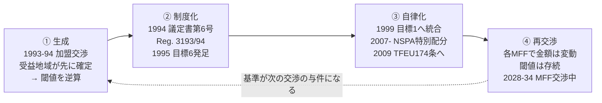

# 研究構想：EU構造基金「目標6」の形成過程と、配分基準の政治経済学

## 1. なぜ「目標6」が面白いのか

EUの構造基金は1988年改革以来、**一人当たりGDPがEU平均の75%未満**という基準で「目標1」地域を定めてきた。
これは「貧しい地域を助ける」という、財政学的にも国際政治的にも説明のつく基準である。

ところが1995年の第4次拡大（オーストリア・フィンランド・スウェーデン）に際して、まったく別の基準が生まれた。
**人口密度8人/km² 未満**という、GDPとも失業率とも無関係な**空間的・人口学的**基準である。
フィンランド・スウェーデンの北部圏は、一人当たりGDPが高いため目標1には決して該当しない。
しかし極寒・遠隔・低密度という「別種の不利」を抱えている。そこで加盟交渉の場で、
既存の枠組みに収まらない受益者のために、**新しい目標カテゴリーそのものが交渉の産物として創設された**。

ここに、この事例の三つの特異性がある。

1. **受益者が先に決まり、基準が後から設計された可能性が高い。** 通常、財政移転の基準は
   「客観的ニーズ指標」として提示され、その適用結果として受益者が決まる。目標6はおそらく逆である。
   基準の内生性（endogeneity of criteria）を、文書で追える形で観察できる稀有なケース。
2. **サイドペイメントが「金額」ではなく「基準」の形をとった。** 一時金であれば交渉終了とともに終わる。
   しかし基準として制度化されたために、目標6は**自動更新される受益権**となった。
3. **その基準は30年生き延び、条約本文にまで到達した。** 目標6というカテゴリー自体は1999年の
   アジェンダ2000で目標1に統合され消滅したが、8人/km² という**閾値は生き残り**、
   2007年以降は北部希薄人口地域（NSPA）向け特別配分として、2009年のリスボン条約では
   TFEU 第174条の「人口密度が極めて低い最北地域」という文言として、**一次法に格上げされた**。

つまりこれは、**一回限りの国際交渉の妥協が、恒久的な財政制度に化けていく過程**の、
始点も終点も文書で押さえられる長期追跡事例である。

## 2. 学術的「問い」

> **国家間交渉の産物である財政的譲歩は、いかにして「基準」へと転化し、
> 交渉の文脈を離れて自律的に作動する財政制度になるのか。**

下位の問いは三つ。

- **Q1（生成）** なぜ一人当たりGDPでも失業率でもなく「人口密度8人/km²」が選ばれたのか。
  閾値8はどのように決まったのか。誰が提案し、誰が抵抗したのか。
- **Q2（自律化）** なぜその基準は、目標6というカテゴリーの消滅後も存続し、
  さらに条約レベルにまで格上げされたのか。正当化の言説はどう書き換えられたのか。
- **Q3（帰結）** その結果、EU財政の再分配構造と、「何が財政移転に値する不利か」という
  規範的了解はどう変わったのか。

## 3. 先行研究の断絶——ここに架け橋が要る

| 分野 | 何を明らかにしてきたか | 何を所与にしてきたか |
|---|---|---|
| EU結束政策研究 | 配分額の決定要因、加盟国間の駆け引き、政策効果の評価 | **基準そのものの生成**。基準は分析の出発点であって対象ではない |
| 国際関係論（拡大・交渉論） | 拡大交渉におけるサイドペイメント、争点連関、二レベルゲーム、修辞的正当化 | 譲歩が**「基準」という形式**をとることの長期的帰結。金額・議席・移行期間には注目するが、基準の耐久性は見ない |
| 財政学（政府間財政移転論） | ニーズ指標の設計、財政調整の規範理論、指標の技術的最適性 | 指標が**国際交渉の産物**である場合。指標設計を技術的・行政的問題として扱う |
| 北欧地域研究・NSPA研究 | 対象地域の実態、政策効果 | 形成史そのもの |

**空隙**：「国際交渉によって作られた財政移転基準」を、交渉過程（IR）と財政制度（財政学）の
双方から一貫して追跡した研究は見当たらない。目標6はその空隙を埋めるのに最適な事例である。

> ⚠ この「空隙」の主張は、応募までに **JCMS / Journal of European Public Policy / Regional Studies /
> Journal of Public Policy**、および北欧の研究機関（Nordregio 等）の文献で必ず裏取りすること。
> 「先行研究がない」と断定するより「形成過程に正面から取り組んだ研究は限られる」と書くほうが安全。

## 4. 仮説と、その反証条件

分析枠組みを「配分基準のライフサイクル」として定式化し、各局面に検証可能な仮説を置く。

| 仮説 | 内容 | 支持される証拠 | 反証される証拠 |
|---|---|---|---|
| **H1 内生的基準** | 基準は、先に確定した受益者集合を事後的に正当化するために逆算設計された | 交渉文書に複数の閾値候補（5・10・12人/km² 等）と、それぞれの対象地域リストが併記されている／境界地域の扱いが争点化している | 閾値が一般原則として先に提示され、対象地域が機械的に算出されている |
| **H2 自律化** | 制度化された数値基準は、当初の政治的文脈から切り離され、普遍的なニーズ指標として作動する | 1999年以降の文書で「北欧2か国への配慮」が「永続的な自然的・人口学的ハンディキャップ」へと言い換えられる／他の加盟国にも中立適用可能な形式で記述される | 一貫して「特定2か国への特別措置」として扱われ続ける |
| **H3 ロックインの非対称性** | 金額は各期の交渉で変動するが、閾値そのものは争点化を免れる | 一人あたり単価・総額は各MFFで変動する一方、8人/km² は30年間一度も改定されていない | 閾値自体が改定されている（→ その改定過程を分析対象に転換） |

H3 は特に強い。**「数字は削られるが、基準は削られない」**という非対称性が確認できれば、
財政学の経路依存論と、IRの制度化論の双方に対して、具体的なメカニズムを提示できる。

## 5. 分析枠組み：配分基準のライフサイクル

この4局面モデルは目標6のために作るが、**他の事例（結束基金の創設、ブレグジット後の配分見直し、
日本の過疎地域指定要件）にも適用可能な一般的枠組み**として提示する。ここが理論的貢献になる。

## 6. 方法と史料

### 6.1 一次史料

**EU側**
- 加盟条約議定書第6号（CELEX: 11994N/PRO/06）、Council Reg. (EC) No 3193/94（OJ L 337, 24.12.1994）
- 加盟交渉会議文書（CONF シリーズ）、理事会文書、委員会文書（当時のDG XVI＝現DG REGIO）
- **30年ルール**（Reg. 354/83）により、1994〜95年の理事会・委員会文書は2024〜25年に公開対象へ。
  → **今が一次史料研究の解禁タイミング**。これは申請書に必ず書く時宜性の論拠。⚠ 実際の公開状況は要確認

**加盟国側**
- スウェーデン：Riksarkivet／外務省(UD)交渉文書、SOU（政府調査報告）、Riksdag 議事録
- フィンランド：Kansallisarkisto／外務省文書、Eduskunta 議事録
- ノルウェー：**交渉時は議定書に含まれていたが、1994年11月の国民投票で加盟を否決した。**
  → ノルウェー側文書は「実現しなかった受益者」の視点から、基準設計の意図を映す鏡になる。
  さらに「交渉時の受益者集合」と「実施時の受益者集合」のズレは、二レベルゲームの教科書的事例であり、
  **基準が特定国のために設計されたのか、それとも一般的ニーズ指標だったのかを識別する自然実験**になる。

### 6.2 オーラルヒストリー
当時の交渉官、委員会関係者、NSPAネットワーク関係者ら10〜15名。半構造化インタビュー。
所属機関の研究倫理審査を経て実施し、EU域内対象者にはGDPR準拠の取扱いを行う。

### 6.3 定量分析：閾値シミュレーションによる H1 の検証

これが本研究の**方法論上の目玉**になる。

1. 1990年代初頭の NUTS2 地域別人口密度データ（Eurostat、各国統計）を復元する。
2. 閾値を 4・6・8・10・12・15人/km² と動かしたときの**対象地域集合**をそれぞれ算出する。
3. 「フィンランド・スウェーデン（＋ノルウェー）が交渉で要求した地域を過不足なく含む最小の閾値」が
   実際の8であったか、他の閾値では域外の地域が混入するか（＝スペイン等の反対を招く）を検証する。
4. 閾値近傍の境界地域（ぎりぎり該当／非該当）を特定し、交渉文書でその扱いがどう論じられたかを突き合わせる。

**「8という数字は自然が決めたのではなく、交渉が決めた」**ことを、
定性史料と定量シミュレーションの両方から示せれば、この研究は成功である。

### 6.4 分析手法
プロセストレーシング（因果メカニズムの検証、smoking-gun / hoop test）、反実仮想分析（ノルウェー離脱）、
閾値シミュレーション、言説分析（1994年 → 2009年リスボン → 2025年MFF提案における正当化言説の変遷）。

## 7. 年次計画（基盤研究(C)・4年を想定）

| 年次 | 内容 | 成果 |
|---|---|---|
| **1年目** | 理論枠組みの構築（IR交渉論×政府間財政移転論の統合）。公開法令・二次文献の網羅。EU公文書（ブリュッセル／フィレンツェHAEU）の予備調査。NUTS2人口密度データベース構築 | 理論枠組み論文（和文1本）、学会報告 |
| **2年目** | 北欧調査（ストックホルム・ヘルシンキ・オスロ）。交渉過程の再構成。インタビュー前半 | 形成過程論文（英文1本投稿） |
| **3年目** | 制度化過程の分析（1999アジェンダ2000／2006／2013／2021の各MFF交渉で基準がどう扱われたか）。閾値シミュレーション。インタビュー後半 | 自律化・ロックイン論文（英文1本投稿）、国際学会報告（UACES/EUSA等） |
| **4年目** | 日欧比較（過疎法の指定要件、地方交付税の密度補正・寒冷補正との対照）。総合。単著構想 | 比較論文（和文1本）、単著企画書、成果公開 |

## 8. 期待される成果と意義

**学術的意義**
- 国際関係論に「財政制度としての帰結」という時間軸を、財政学に「基準は交渉の産物である」という
  政治過程の視点を、それぞれ持ち込む。「配分基準の政治経済学」という分析枠組みの提示。

**政策的・時宜的意義**
- 欧州委員会は2025年7月16日に **2028–2034年MFF** を提案し、結束政策を「国家・地域パートナーシップ計画」に
  統合する構想を示した。**NSPA向け配分の存廃はまさに現在進行中の争点**である。
  この枠組みが「そもそもなぜ、どういう論理で作られたのか」を史料に基づいて示すことは、
  現在の議論に直接寄与する。**研究期間中にこの交渉が決着するため、リアルタイムの追跡が可能**。

**日本への含意**
- 人口減少下の日本は、まさに「低密度」を財政移転の根拠にできるかを問われている。
  過疎地域の指定要件、地方交付税の密度補正・寒冷補正は、EUの8人/km² と同型の「基準政治」の産物である。
  EUが低密度を永続的ハンディキャップとして条約に書き込むに至った30年は、日本の制度設計に直接の比較材料となる。

**教育還元（書けば加点、書かなくても可）**
- 本リポジトリの模擬EU教材（Model EU Portal）に、「目標6交渉」を再現する交渉シミュレーションを実装する。
  研究成果を学部教育に還元する具体的な回路として提示できる。

## 9. 科研費戦略

### 9.1 審査区分の選択——ここが最大の勝負どころ

「架け橋」は魅力だが、**両分野に等距離で書くと両方から「自分の分野ではない」と見られる**。
区分を決め打ちし、その分野の評価軸で書き切ること。

| | **06020 国際関係論関連（本命）** | **07050 財政および公共経済関連（対抗）** |
|---|---|---|
| 前面に出す語 | 加盟交渉、サイドペイメント、二レベルゲーム、制度化、拡大 | 政府間財政移転、ニーズ指標、財政調整、経路依存、再分配 |
| 主要な問い | 交渉の産物がなぜ恒久制度になるのか | 移転基準はどう設計され、なぜ改定されないのか |
| 「架橋」の扱い | 財政学は**分析手段**として導入 | IRは**基準の生成を説明する外生要因**として導入 |
| 定量分析の位置 | 補助的（史料の裏付け） | 中核（閾値シミュレーション、境界事例） |
| リスク | 「財政の話は専門外」と見られる | 「歴史記述であって経済学ではない」と見られる |

⚠ 小区分番号（06010 政治学関連／06020 国際関係論関連／07050 財政および公共経済関連）は
最新の審査区分表で必ず確認すること。名称の微修正がありうる。

### 9.2 種目

- **基盤研究(C)**（3〜5年・総額400万円以内）を既定とする。史料調査中心・単独研究の規模に合う。
- **若手研究**の要件に該当するなら、そちらのほうが競争環境は緩やか。
- **挑戦的研究（萌芽）**は分野架橋・挑戦性を正面から評価する種目で、この構想の性格には合う。
  ⚠ ただし同一年度の重複応募制限を必ず公募要領で確認すること。

### 9.3 研究経費（基盤(C)・4年・総額400万円の目安）

| 費目 | 金額 | 内訳 |
|---|---|---|
| 旅費 | 240万円 | 欧州調査 計5回（ブリュッセル／フィレンツェ／ストックホルム／ヘルシンキ／オスロ）＋国内学会 |
| 物品費 | 60万円 | 文献・史料複製・デジタル化、統計データ、PC・保存機器 |
| 人件費・謝金 | 60万円 | インタビュー起こし、資料整理、フィンランド語翻訳 |
| その他 | 40万円 | 英文校閲、学会参加費、オープンアクセス掲載料 |

### 9.4 リスクと対応（申請書に明記すると評価が上がる）

| リスク | 対応 |
|---|---|
| 公文書が未公開・非公開 | 公開済み法令・議会審議録・各国政府報告で代替。北欧2国は情報公開制度が充実。オーラルヒストリーで補完 |
| 言語（フィンランド語） | 交渉文書の多くは英語・スウェーデン語。翻訳費を計上し、現地研究者と連携 |
| 渡航が困難になる | 文書のデジタル化請求、オンラインインタビューへの切替 |
| 「架橋」がどっちつかずに見える | 審査区分を決め打ちし、9.1 の書き分けを徹底 |

## 10. 研究課題名の候補

| 案 | 課題名 | 狙い |
|---|---|---|
| A | 国際交渉が生んだ財政基準——EU構造基金「目標6」の形成と制度化 | バランス型。両区分に対応 |
| B | EU構造基金「目標6」の形成過程——配分基準の政治経済学 | 06020向け。交渉・過程を前面に |
| C | 財政移転基準はいかに生まれるか——EU「目標6」と人口密度基準の30年 | 07050向け。基準設計を前面に |

⚠ 研究課題名の字数上限は公募要領で確認すること。

## 11. 主な参照文献（書誌情報は要最終確認）

**国際関係論・EU研究**
- Moravcsik, A. *The Choice for Europe* (1998) — 政府間交渉と国内利益の統合理論
- Schimmelfennig, F. *The EU, NATO and the Integration of Europe* (2003) — 拡大の修辞的正当化
- Plümper, T. & Schneider, C. "Discriminatory European Union membership and the redistribution of enlargement gains" (2007)
- Lindner, J. *Conflict and Change in EU Budgetary Politics* (2006)
- Ackrill, R. & Kay, A. "Historical-institutionalist perspectives on the development of the EU budget system" (2006) — 経路依存
- Bachtler, J. & Mendez, C. — 結束政策の配分と改革
- Carrubba, C. "Net Financial Transfers in the European Union: Who Gets What and Why?" (1997)
- Putnam, R. "Diplomacy and Domestic Politics: The Logic of Two-Level Games" (1988)
- Beach, D. & Pedersen, R. *Process-Tracing Methods* (2013) — 方法論

**財政学**
- Oates, W. *Fiscal Federalism* (1972); "An Essay on Fiscal Federalism" (1999)
- Musgrave, R. — 財政の三機能と再分配
- Boadway, R. & Shah, A. *Fiscal Federalism* (2009) — 財政調整とニーズ指標の設計
- Bird, R. & Smart, M. — 政府間移転の設計原理
- MacDougall Report (1977) — EU財政連邦主義の古典
- 日本：地方交付税の基準財政需要額（測定単位・密度補正・寒冷補正）、過疎地域の指定要件に関する総務省資料

**⚠ 応募前に必ず**：目標6・NSPAを直接扱った既存研究（Nordregio、北欧各国の研究、
EU公文書を使った拡大交渉研究）をサーベイし、「先行研究の空隙」の主張を確定させること。
